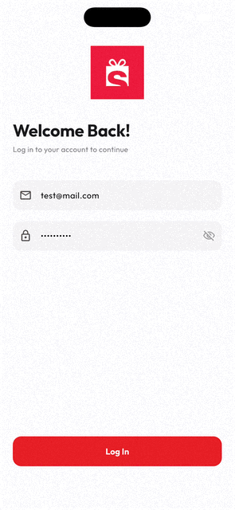
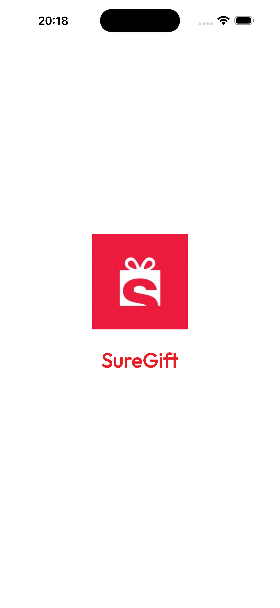
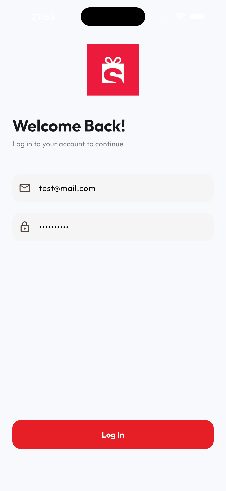
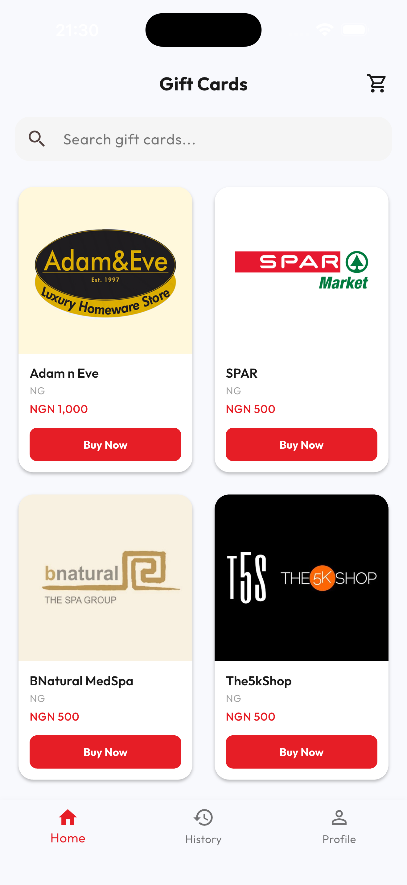
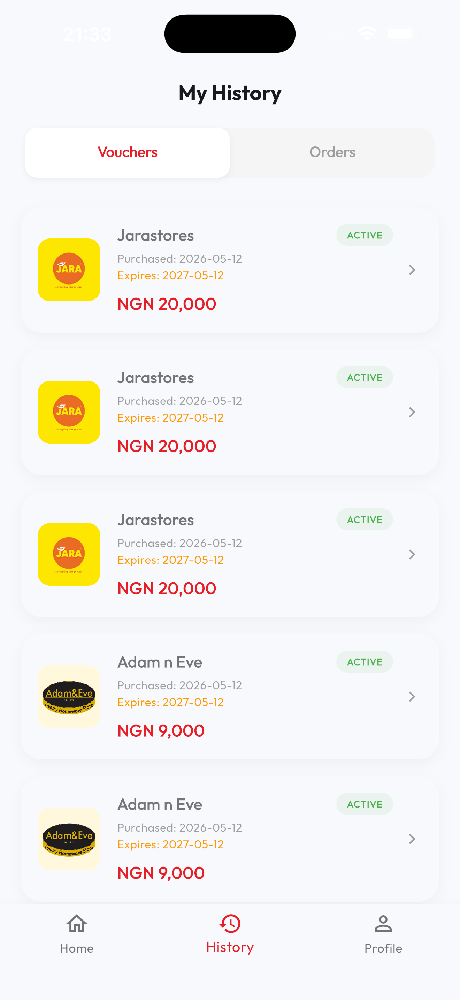
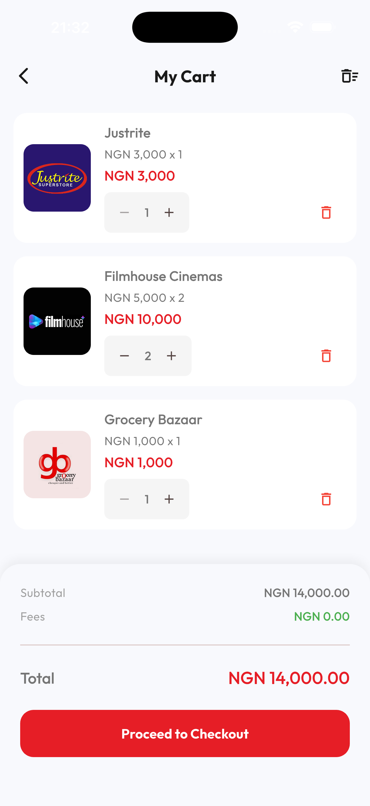
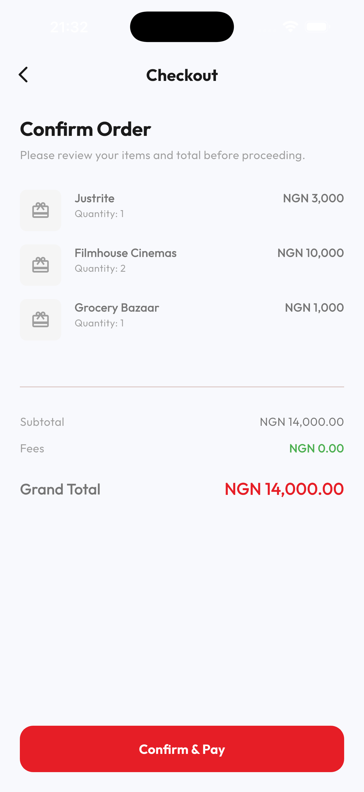
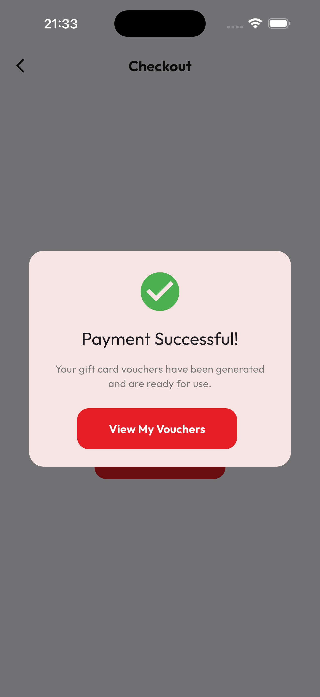

# SureGift Mobile Application

A premium, production-grade mobile application for purchasing and managing gift cards. Built with Flutter, following Clean Architecture and modern MVVM patterns with a focus on robust stability and premium UX.

## 📥 Download APK
[Download the latest Android APK here](https://drive.google.com/file/d/1R3bgtFJXultrytPO1Eh3TgKi6bCr9T7U/view?usp=sharing)

## 📱 Screenshots

<div align="center">
  
</div>

<p align="center">
  
  
  
  
</p>

<p align="center">
  
  
  
  
</p>

## 🚀 Key Features

### 1. Product Catalogue
- **Real-time Discovery**: Browse a comprehensive list of gift cards fetched from the SureGifts production API.
- **Advanced Search**: Search by name, category, or country with high-performance filtering.
- **Regional Support**: Clear indicators for country/region and local currency.
- **Smooth UX**: Pull-to-refresh and Shimmer loading states for a premium feel.

### 2. Product Details (Refined)
- **Chip-based Amount Selection**: Intuitive tap-to-select chips for gift amounts, strictly synchronized with API denominations.
- **Aggressive Data Filtering**: Automatically hides invalid or 0-value amounts to ensure a clean purchase flow.
- **Redemption Guide**: Clear, bulleted instructions for using the voucher.
- **Tactile Feedback**: Interactive quantity selector and immediate "Add to Cart" confirmation.

### 3. Shopping Cart & Checkout
- **Real-time Quantity Control**: Adjust or remove items directly in the cart with instant subtotal updates.
- **Smart Checkout**: One-tap checkout with a beautiful, animated success dialog and automated voucher generation.
- **Validation**: Robust error handling that prevents adding invalid items to the cart.

### 4. Order & Voucher History
- **Dual Tracking**: Separate tabs for viewing high-level **Orders** and individual **Purchased Vouchers**.
- **Detailed Voucher Views**: View voucher codes, PINs, serial numbers, and expiry dates with one-tap "Copy to Clipboard" functionality.

### 5. Personalization & Stability
- **Persistent Theme**: Full support for Light and Dark modes, with user preferences persisted across app restarts using `shared_preferences`.
- **API Stabilization**: Corrected production endpoints for both Authentication and Product Catalog to ensure zero 404 errors.
- **Platform Resilience**: Defensive error handling for native channel initialization (shared_preferences) to prevent startup crashes.

## 🛠 Architecture & Code Quality

### Separation of Concerns (SoC)
The app is built using strict **Clean Architecture** and **MVVM** principles:
- **Data Layer**: Repositories and models (using `json_serializable`). Business logic (like amount filtering) is encapsulated within the model layer for reusability.
- **Controller Layer**: StateNotifier-based controllers (e.g., `ProductController`) decouple the UI from the repository, handling loading states and error orchestration.
- **Presentation Layer**: Atomic widgets and modular screens. The UI only observes the controller and model, with zero raw logic in the widget classes.

### Reusable Components
A custom design system was created in `lib/core/widgets/common_widgets.dart`, including:
- `AppButton`: Unified button style with loading states and tactile animations.
- `AppTextField`: Consistent input styling with support for masks and robust validation.
- `TopSnackbar`: A premium, animated notification system (Green for success, Red for errors) capable of parsing complex technical errors into friendly text.
- `NiceErrorWidget`: Friendly, non-technical error screens for better UX.

### Security & Token Management
- **Secure Storage**: Sensitive data like JWT tokens are stored using `flutter_secure_storage` (AES encryption).
- **Session Protection**: A `Dio` interceptor automatically detects `401 Unauthorized` responses and performs a global hard-reset, logging the user out securely.

## 📦 Getting Started

1. **Install Dependencies**:
   ```bash
   flutter pub get
   ```

2. **Run the App**:
   ```bash
   flutter run
   ```
   *Note: A full restart is recommended after the first run to ensure all native storage plugins are correctly linked.*

3. **Login Credentials**:
   - **Email**: `user@suregifts.com.ng`
   - **Password**: `password` (any non-empty string works for this assessment)
